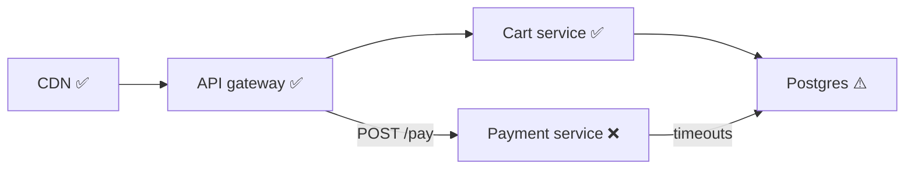

## Checkout request path

```mermaid
graph LR
  cdn["CDN ✅"] --> api["API gateway ✅"]
  api --> cart["Cart service ✅"]
  api -- "POST /pay" --> pay["Payment service ❌"]
  cart --> db["Postgres ⚠️"]
  pay -- "timeouts" --> db
```
